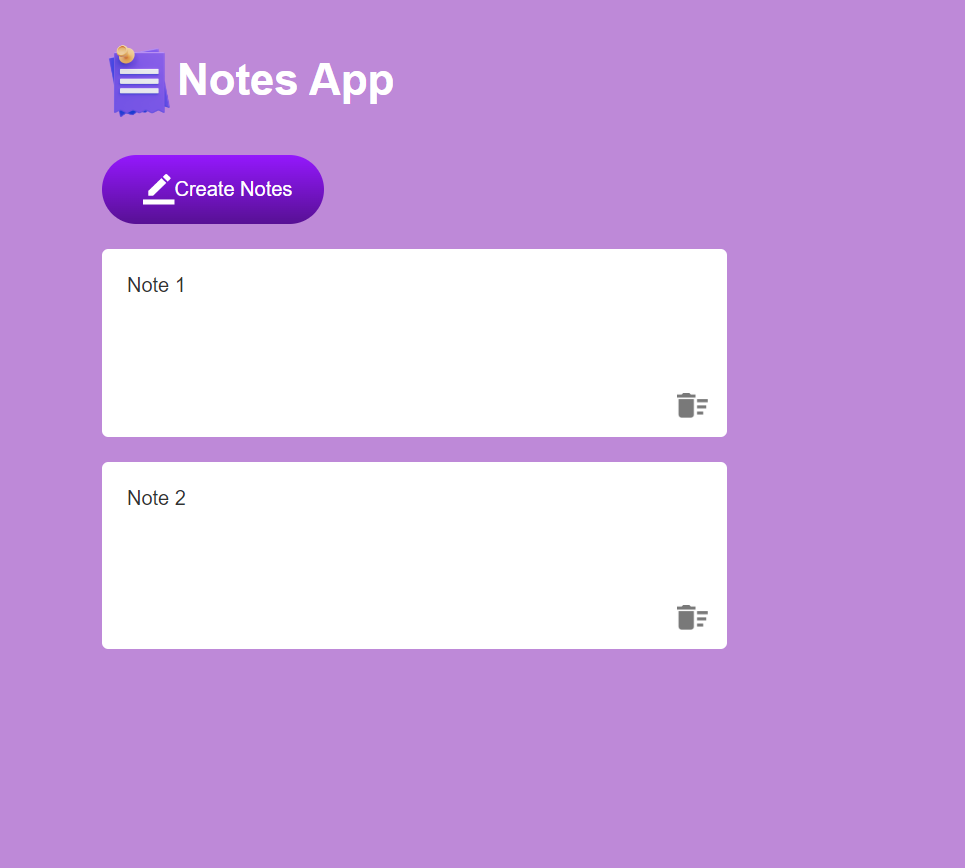

# Notes App

A simple web-based application for creating, editing, and deleting notes. The notes are stored locally using localStorage, so they persist even after closing the browser.

## Features

- **Create Notes**: Add new editable notes.
- **Edit Notes**: Modify notes directly in the browser.
- **Delete Notes**: Remove notes using the delete icon.
- **Persistent Storage**: Notes are saved in localStorage.

## Technologies Used

- **HTML** for structure
- **CSS** for styling
- **JavaScript** for functionality

## How to Use

1. Clone or download the project.
2. Open the index.html file in a browser to start using the app.
